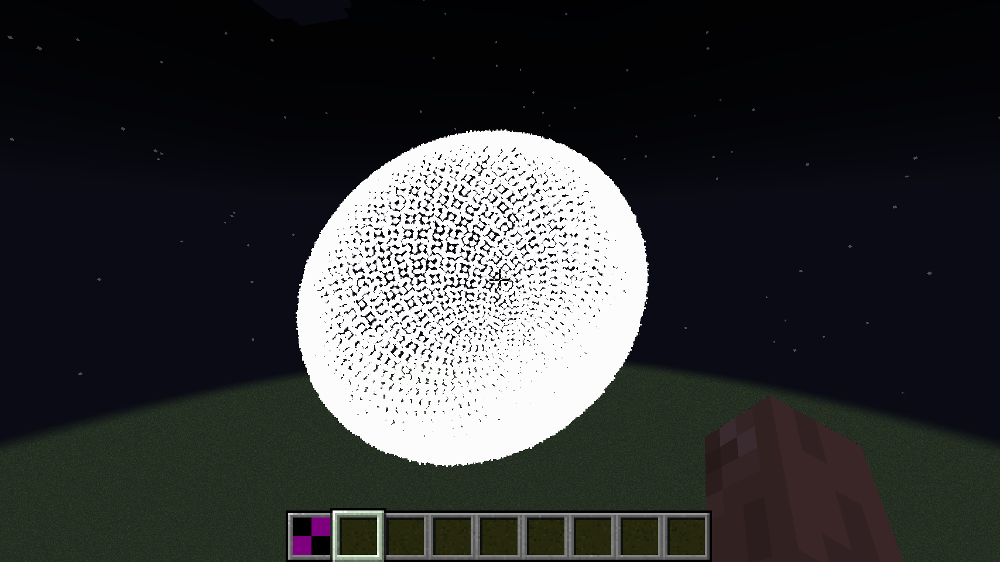
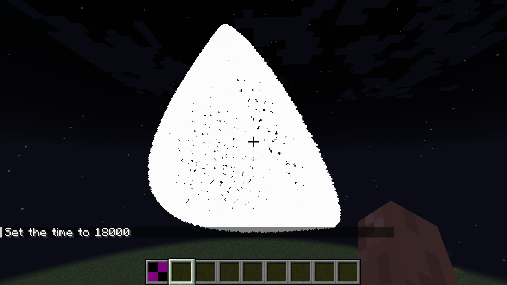

# 
APEL

**A**nimative **P**article **E**ngine **L**ibrary, also known as Apel is a 
fully featured minecraft library mod that promises to bring a fully featured 
particle animation engine that has never been seen before. It comes bundled 
with many predefined shapes and has huge capabilities; its goal is to provide 
the developer huge flexibility and allow to easily maintain complex scenes with 
high performance.
All without the need of knowing complex mathematics (such as linear algebra, although a basic grasp is recommended)  

## Gallery

    
    

## Key Features
- **Particle Objects:** These are objects which render, they can be 2D, 3D shapes (such as a cube, circle, triangle) or 
even more complex ones like a cat or a dog (these aren't implemented to the library), they are classes that inherit 
from / extend the ``ParticleObject`` class, they also define a draw method which accepts the renderer, the current step 
the animator is in & the position to render at. 
This is where the render calculations happen to project the result onto the world; Particle objects can be used in 
multiple animators which is called **multi-instancing**. 
They can also define their own interceptors and attributes that can be modified by using the Interceptor API. 
Particle objects can also be rotated in 3D **<ins>which is measured in radians</ins>**. 
Unlike path animators they only use an "amount" of particles for the shape 
(Since the shape is not a complete but rather a dotted one, where each dot is a particle). 
When using the Interceptors API, you are in control of what data you want to give the user & what data can be modified. 
Interceptors are expressed as function that know have the data the object gave them and know which object they modify 
which means they themselves can tweak public params.

- **Path Animators:** These define the trajectory a particle object should follow. They are used to create detailed
and even procedural animations. When beginning the animation logic, the system uses the so-called rendering steps. These are
basically like frames from a video(or animation) in which they define certain changes. Particle objects are aware 
what step they are on (as mentioned in the inner workings of the drawing method).
Animators can play from the start to the end or some start & some end parts can be trimmed (just like how you do in videos). 
The problem with rendering steps is that they are constant and won't look pleasing on large distances which is why 
there are rendering intervals. They measure the distance per rendering step which allows for more consistent looking 
animations on larger distances (at the expense of performance. Since the server has to process more particles and calculations). 
They hold two methods, the first being ``convertStep`` which takes care of the conversation between the rendering interval 
and the amount and ``beginAnimation`` which is where the actual logic resides in, they should support trimming. When 
trimming happens at the start, all the calculations are done, but the particle object is not rendered, trimming on the end 
just breaks the loop. Path animators **MUST** allocate a sequence first (they can do only one) which is done by 
using ``allocateToScheduler`` and to then draw, the method ``handleDrawingStep`` should be used. Path animators 
come in a bundle with listeners which listen to three specific events which happen when the animator starts 
when it processes (each step it is called) and when the animator ends (either normally or abruptly)  

- **Renderers:** These are objects that define how the rendering should be done, the basic default renderer allows for
drawing individual particle effects onto the world, other renderers allow for more complex rendering methods.
Although this system is a bit more niche than the other systems, still this system is useful in certain problems 
where it cannot be done with particle objects, interceptors or any other form of drawing.
Particle objects are aware of the renderer during a draw call and can use them to do their own things 

## Getting Started
The first obvious thing is to create an ``ParticleObject``, pick your desired object to create and supply the params,
the second thing is creating the path animator object to use which will describe the motion of that object. And finally
use on the animator the ``beginAnimation`` and supply it with ``ApelRenderer.create(world)`` where world is the 
server world, now it should play entire animation! 

## Credits & Contributions
This project is founded & led by McBrincie212, contributions are welcome as long as they don't do anything shady such
as embedding malware, doing inappropriate things... 
After all, the project is meant to be improved & expanded upon with new ideas, 
new systems and more stuff that boost productivity and enhance the work experience